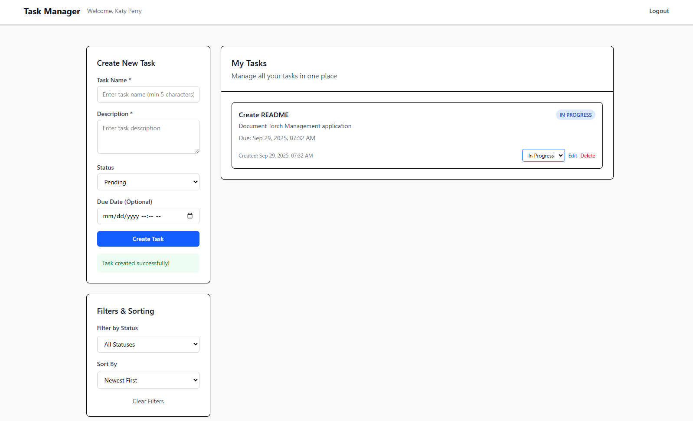

# Torch Task Management - A GraphQL Task Manager



## Overview

This is a full-stack CRUD task manager built with React + TypeScript, Node.js + Express + GraphQL, and a PostgreSQL database.

## Features

### Core Features
- Create, Read, Update, Delete (CRUD) and sort tasks
- Simple, responsive UI to manage tasks
- Dockerized Backend built with Node.js + Express + TypeScript
- Dockerized Frontend built with React + TypeScript
- Database integration with PostgreSQL and Prisma
- Error handling with proper HTTP status codes

### Frontend Features
- Add, view, edit, and delete tasks
- Data fetching and caching with React Query
- Global state management with Zustand
- Navigation between pages using React Router
- Styled with Tailwind CSS for a modern, responsive design

### Backend Features
- GraphQL API implementation with Apollo Server for task management
- JWT authentication for secure access 
- Schema validation with Zod for safe input
- Prisma ORM for type-safe database queries and migrations
- API testing under backend/test/graphql

## Tech Stack

**BackEnd**
- **TypeScript**: TypeScript 5.0
- **Node.js**: v20.0.0 - Server-side runtime environment that handles backend logic, manages APIs, and runs build tools
- **Express**: v4.18.0 - Web framework for building APIs and handling HTTP requests
- **GraphQL**: v4.9.5 - Flexible query language for APIs that allows clients to request exactly the data they need
- **PostgreSql**: Open-source relational database for structured data storage
- **Zod**: v3.22.0 - Schema validation library ensuring input data is safe and correctly typed
- **JWT Authentication**: v9.0.2 - Securely verifies users and manages sessions using JSON Web Tokens
- **Apollo Server**: v4.9.5 - GraphQL server implementation
- **Prisma**: v5.22.0 - Type-safe ORM to simplify database queries and migrations

**Front-End**
- **React**: v19.1.1 - Component-based JavaScript library for building dynamic and responsive UIs 
- **Vite**: v7.1.7 - build tool offering fast development server and optimized builds
- **TypeScript**: TypeScript 5.0
- **React-Query**: v5.90.2 - Data fetching and caching library that simplifies server state management
- **Zustand**: v5.0.8 - Lightweight state management library for React
- **React-router-dom** v7.9.3 - Routing for navigation between pages in a React app
- **Tailwindcss**: v4.1.13 - Utility-first CSS framework for quick UI styling and responsive design


## Setup and Installation
1. **Clone this repo**:
   ```bash
   git clone https://github.com/kperryr/TorchTaskManagement.git
   
2. **For development purposes, please use the .env file as shown below:**
   ```bash
   # Database Configuration
   POSTGRES_USER=postgres
   POSTGRES_PASSWORD=password
   POSTGRES_DB=TorchManagement
   DATABASE_URL=postgresql://postgres:password@db:5432/TorchManagement?schema=public
   
   # Application Configuration
   NODE_ENV=development
   PORT=4000
   
   # Frontend 
   VITE_API_URL=http://localhost:4000
   
3. **Run Docker and build/start Docker Container**:
   ```bash
   docker-compose up
   
4. **Run the link below in your browser to access the application**:
   ```bash
   http://localhost:5173/
